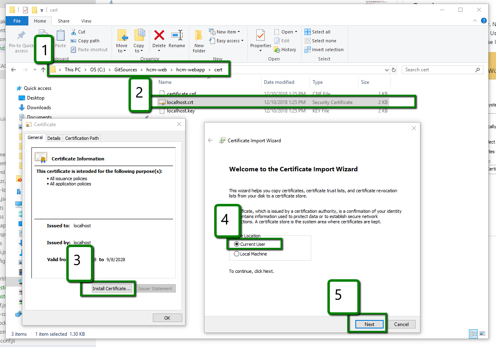
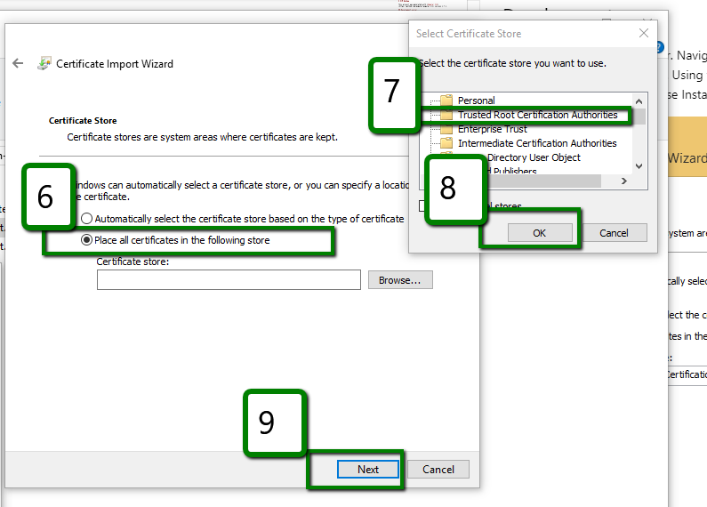

# HCM WebApp

## Installing the development certificate
Follow the steps bellow
* Navigate to file `./cert/localhost.crt`
* Double Click file
* Choose Install
* When prompted Choose `Current User`
* Click Next
* Choose `Place all certificates in the following store`
* Choose `Trusted Root Certification Authorities`
* Click Ok
* Next and finish

## Development server

Run `ng serve` for a dev server. Navigate to `https://localhost:50319`. The app will automatically reload if you change any of the source files. You'll need to run this code with ssl `HTTPS` it can be done in 2 ways.
 
 1. `"ng serve --ssl --ssl-key .\cert\localhost.key  --ssl-cert .\cert\localhost.crt"`
 2. `npm start`
 

 
## Code scaffolding

Run `ng generate component component-name` to generate a new component. You can also use `ng generate directive|pipe|service|class|guard|interface|enum|module`.

## Build

Run `ng build` to build the project. The build artifacts will be stored in the `dist/` directory. Use the `-prod` flag for a production build.

## Running unit tests

Run `ng test` to execute the unit tests via [Karma](https://karma-runner.github.io).

## Running end-to-end tests

Run `ng e2e` to execute the end-to-end tests via [Protractor](http://www.protractortest.org/).

## Further help

To get more help on the Angular CLI use `ng help` or go check out the [Angular CLI README](https://github.com/angular/angular-cli/blob/master/README.md).

# **Guidelines** Code of conduct

## Code Check In  
Development code should only be comitted `develop` branch and it should be production ready code. 

## Branching
Branch names should always reflect task on hand 
 **Keep the names *short* and *descriptive***
  
  - Feature development `feat-[featureName]/develop`
  - Hot fix (or master code bug fix) `hotfix-[bug]/master` 
